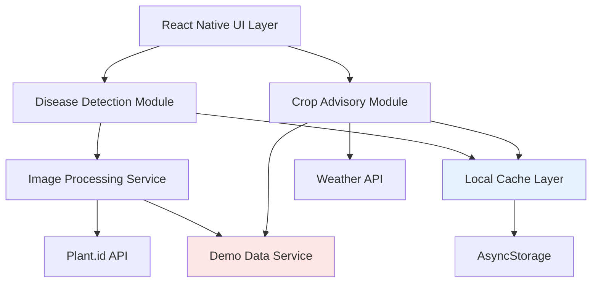

# Design Document: AI Farmer Assistance Features

## Overview

This design specifies the implementation of AI-powered features for the Farmer Assist mobile application, targeting the "AI for Bharat" hackathon with a 4-day implementation timeline. The system integrates crop disease detection, intelligent crop advisory, and weather-based recommendations into the existing React Native/Expo application.

The design prioritizes demo reliability through robust fallback mechanisms, offline capability through aggressive caching, and accessibility through multilingual support (English/Hindi). All AI features are designed to work with existing third-party APIs (Plant.id for disease detection, OpenWeatherMap for weather data) while maintaining graceful degradation when services are unavailable.

### Key Design Principles

1. **Demo-First Architecture**: Every AI feature includes a demo mode with pre-loaded sample data
2. **Offline-First**: Aggressive caching ensures core functionality works without connectivity
3. **Progressive Enhancement**: Features degrade gracefully from live API → cached data → demo mode
4. **Rapid Integration**: Leverage existing APIs and libraries rather than custom ML models
5. **Accessibility**: Simple UI with multilingual support for low-literacy users

## Architecture

### System Components



### Data Flow

**Disease Detection Flow:**
1. User captures/selects image → Image validation → Compression
2. Attempt API call to Plant.id with 10s timeout
3. On success: Display results + cache response
4. On failure: Check cache for similar images → Fall back to demo mode
5. Save scan to history (regardless of source)

**Crop Advisory Flow:**
1. Fetch weather data (with 6-hour cache validity)
2. Generate recommendations based on weather + season
3. On API failure: Use cached weather + display staleness indicator
4. On no cache: Use demo mode with generic seasonal advice

### Technology Stack

- **Frontend**: React Native 0.81.5, Expo SDK 54, TypeScript
- **Navigation**: Expo Router 6.0
- **Camera**: expo-camera (to be added)
- **Storage**: AsyncStorage via @react-native-async-storage/async-storage (to be added)
- **Image Processing**: expo-image-manipulator (to be added)
- **HTTP Client**: fetch API with timeout wrapper
- **Internationalization**: i18n-js (to be added)
- **AI Services**: Plant.id API, OpenWeatherMap API

## Components and Interfaces

### 1. Disease Detection Module

**Location**: `app/features/disease-detection/`

#### Core Components

**DiseaseDetectionScreen.tsx**
```typescript
interface DiseaseDetectionScreenProps {
  navigation: NavigationProp;
}

// Main screen with camera interface and scan history
```

**CameraInterface.tsx**
```typescript
interface CameraInterfaceProps {
  onCapture: (imageUri: string) => Promise<void>;
  onGallerySelect: () => Promise<void>;
}

// Handles camera capture with visual guidelines
// Shows framing overlay for proper image composition
```

**ScanResultsView.tsx**
```typescript
interface ScanResult {
  diseaseId: string;
  diseaseName: {
    en: string;
    hi: string;
  };
  confidence: number; // 0-100
  imageUri: string;
  treatments: Treatment[];
  timestamp: number;
  source: 'api' | 'cache' | 'demo';
}

interface Treatment {
  id: string;
  name: { en: string; hi: string };
  type: 'organic' | 'chemical';
  instructions: { en: string; hi: string };
  safetyNotes: { en: string; hi: string };
  estimatedCost?: number; // in INR
}

// Displays disease identification results with treatments
```

**ScanHistoryView.tsx**
```typescript
interface ScanHistoryItem {
  id: string;
  imageUri: string;
  diseaseName: { en: string; hi: string };
  confidence: number;
  timestamp: number;
  location?: string;
}

// Lists previous scans in reverse chronological order
// Supports grouping by field/location
```

#### Services

**ImageAnalysisService.ts**
```typescript
interface ImageAnalysisService {
  analyzeImage(imageUri: string): Promise<ScanResult>;
  validateImageQuality(imageUri: string): Promise<ValidationResult>;
  compressImage(imageUri: string): Promise<string>;
}

interface ValidationResult {
  isValid: boolean;
  issues: Array<'too_dark' | 'too_bright' | 'blurry' | 'no_plant'>;
  suggestions: { en: string; hi: string }[];
}

// Validates, compresses, and analyzes crop images
// Implements retry logic and fallback to demo mode
```

**PlantIdApiClient.ts**
```typescript
interface PlantIdApiClient {
  identifyDisease(imageBase64: string): Promise<ApiResponse>;
  checkHealth(): Promise<boolean>;
}

interface ApiResponse {
  suggestions: Array<{
    id: string;
    name: string;
    probability: number;
    similar_images: string[];
  }>;
  is_healthy: boolean;
}

// Wrapper for Plant.id API with timeout and error handling
// API Key stored in environment variables
```

**DiseaseCache.ts**
```typescript
interface DiseaseCache {
  saveScan(scan: ScanResult): Promise<void>;
  getScanHistory(limit?: number): Promise<ScanResult[]>;
  findSimilarScans(imageUri: string): Promise<ScanResult[]>;
  clearOldScans(keepRecent: number): Promise<void>;
}

// Manages local storage of scan results
// Implements LRU eviction when storage is limited
```

**TreatmentDatabase.ts**
```typescript
interface TreatmentDatabase {
  getTreatments(diseaseId: string): Promise<Treatment[]>;
  searchTreatments(query: string): Promise<Treatment[]>;
}

// Static database of treatments bundled with app
// Supports offline access to treatment recommendations
```

### 2. Crop Advisory Module

**Location**: `app/features/crop-advisory/`

#### Core Components

**CropAdvisoryScreen.tsx**
```typescript
interface CropAdvisoryScreenProps {
  navigation: NavigationProp;
}

// Main screen showing weather-based recommendations
```

**WeatherCard.tsx**
```typescript
interface WeatherData {
  temperature: number;
  humidity: number;
  rainfall: number;
  forecast: Array<{
    date: string;
    temp: number;
    condition: string;
  }>;
  lastUpdated: number;
  isStale: boolean;
}

// Displays current weather with visual indicators
// Shows staleness indicator when using cached data
```

**CropRecommendationsList.tsx**
```typescript
interface CropRecommendation {
  cropId: string;
  cropName: { en: string; hi: string };
  suitabilityScore: number; // 0-100
  reasoning: { en: string; hi: string };
  plantingGuidelines: {
    bestTime: string;
    soilPrep: { en: string; hi: string };
    wateringSchedule: { en: string; hi: string };
    expectedHarvest: string; // e.g., "90-120 days"
  };
  icon: string; // emoji
}

// Lists recommended crops with reasoning
// Expandable cards showing detailed guidelines
```

**FarmingAlertsView.tsx**
```typescript
interface FarmingAlert {
  id: string;
  type: 'rain' | 'heat' | 'frost' | 'wind';
  severity: 'info' | 'warning' | 'critical';
  message: { en: string; hi: string };
  actionable: { en: string; hi: string };
  icon: string;
  validUntil: number;
}

// Displays weather-based farming alerts
// Uses color coding and icons for quick recognition
```

#### Services

**WeatherService.ts**
```typescript
interface WeatherService {
  getCurrentWeather(location: Coordinates): Promise<WeatherData>;
  getForecast(location: Coordinates, days: number): Promise<WeatherData>;
  getCachedWeather(): Promise<WeatherData | null>;
}

interface Coordinates {
  latitude: number;
  longitude: number;
}

// Fetches weather data from OpenWeatherMap API
// Implements 6-hour cache validity
// Falls back to demo mode on failure
```

**CropAdvisoryEngine.ts**
```typescript
interface CropAdvisoryEngine {
  generateRecommendations(
    weather: WeatherData,
    season: Season,
    location: string
  ): Promise<CropRecommendation[]>;
  
  generateAlerts(weather: WeatherData): FarmingAlert[];
}

type Season = 'kharif' | 'rabi' | 'zaid'; // Indian agricultural seasons

// Rule-based engine for crop recommendations
// Considers temperature, rainfall, season, and region
```

**CropDatabase.ts**
```typescript
interface CropDatabase {
  getCropInfo(cropId: string): Promise<CropInfo>;
  searchCrops(filters: CropFilters): Promise<CropInfo[]>;
}

interface CropInfo {
  id: string;
  name: { en: string; hi: string };
  optimalTemp: { min: number; max: number };
  waterRequirement: 'low' | 'medium' | 'high';
  soilType: string[];
  growthDuration: number; // days
  season: Season[];
}

interface CropFilters {
  temperature?: number;
  rainfall?: number;
  season?: Season;
  region?: string;
}

// Static database of crop information
// Bundled with app for offline access
```

### 3. Shared Services

**Location**: `app/services/`

**CacheManager.ts**
```typescript
interface CacheManager {
  set<T>(key: string, value: T, ttl?: number): Promise<void>;
  get<T>(key: string): Promise<T | null>;
  isStale(key: string): Promise<boolean>;
  clear(pattern?: string): Promise<void>;
}

// Generic cache manager using AsyncStorage
// Supports TTL and staleness checking
```

**DemoDataService.ts**
```typescript
interface DemoDataService {
  getDemoScanResult(imageUri: string): Promise<ScanResult>;
  getDemoWeather(): Promise<WeatherData>;
  getDemoCropRecommendations(): Promise<CropRecommendation[]>;
  isDemoMode(): boolean;
  setDemoMode(enabled: boolean): void;
}

// Provides realistic sample data for demo mode
// Includes 10-15 pre-loaded disease samples
// Automatically activates when APIs are unavailable
```

**LocalizationService.ts**
```typescript
interface LocalizationService {
  setLanguage(lang: 'en' | 'hi'): void;
  getLanguage(): 'en' | 'hi';
  translate(key: string): string;
  translateObject<T extends Record<string, any>>(obj: T): string;
}

// Manages app language and translations
// Auto-detects device language on first launch
// Supports English and Hindi
```

**NetworkService.ts**
```typescript
interface NetworkService {
  fetchWithTimeout<T>(
    url: string,
    options: RequestInit,
    timeout: number
  ): Promise<T>;
  
  isOnline(): Promise<boolean>;
  
  retryWithBackoff<T>(
    fn: () => Promise<T>,
    maxRetries: number
  ): Promise<T>;
}

// Wrapper for fetch with timeout and retry logic
// Detects network connectivity
```

### 4. UI Components

**Location**: `components/features/`

**LanguageToggle.tsx**
```typescript
interface LanguageToggleProps {
  currentLanguage: 'en' | 'hi';
  onLanguageChange: (lang: 'en' | 'hi') => void;
}

// Toggle button for switching between English and Hindi
```

**DemoModeIndicator.tsx**
```typescript
interface DemoModeIndicatorProps {
  visible: boolean;
}

// Subtle banner indicating demo mode is active
// Positioned at top of screen with low opacity
```

**OfflineIndicator.tsx**
```typescript
interface OfflineIndicatorProps {
  isOffline: boolean;
}

// Small indicator showing offline status
```

**LoadingOverlay.tsx**
```typescript
interface LoadingOverlayProps {
  visible: boolean;
  message?: { en: string; hi: string };
  progress?: number; // 0-100
}

// Full-screen loading overlay with progress indicator
```

## Data Models

### Storage Schema

**AsyncStorage Keys:**
```typescript
const STORAGE_KEYS = {
  SCAN_HISTORY: 'farmer_assist:scan_history',
  WEATHER_CACHE: 'farmer_assist:weather_cache',
  CROP_RECOMMENDATIONS: 'farmer_assist:crop_recommendations',
  USER_LANGUAGE: 'farmer_assist:user_language',
  DEMO_MODE: 'farmer_assist:demo_mode',
  API_KEYS: 'farmer_assist:api_keys',
} as const;
```

**Scan History Storage:**
```typescript
interface StoredScanHistory {
  scans: ScanResult[];
  lastUpdated: number;
  version: number; // for migration support
}

// Maximum 50 scans stored
// Oldest scans evicted when limit reached
// Images stored as file URIs in app's document directory
```

**Weather Cache Storage:**
```typescript
interface StoredWeatherCache {
  data: WeatherData;
  cachedAt: number;
  location: Coordinates;
  ttl: number; // 6 hours = 21600000ms
}

// Single weather cache entry
// Invalidated after 6 hours
```

**Treatment Database Schema:**
```typescript
interface TreatmentRecord {
  diseaseId: string;
  diseaseName: { en: string; hi: string };
  treatments: Treatment[];
  symptoms: { en: string[]; hi: string[] };
  prevention: { en: string[]; hi: string[] };
}

// Static JSON file bundled with app
// Located at: assets/data/treatments.json
```

**Crop Database Schema:**
```typescript
interface CropRecord {
  id: string;
  name: { en: string; hi: string };
  scientificName: string;
  optimalConditions: {
    temperature: { min: number; max: number };
    rainfall: { min: number; max: number };
    soilPh: { min: number; max: number };
  };
  seasons: Season[];
  regions: string[];
  growthDuration: number;
  wateringSchedule: { en: string; hi: string };
  commonPests: string[];
  icon: string;
}

// Static JSON file bundled with app
// Located at: assets/data/crops.json
```

### Demo Data

**Pre-loaded Disease Samples:**
```typescript
interface DemoDiseaseSample {
  id: string;
  imagePath: string; // assets/demo/diseases/
  disease: {
    id: string;
    name: { en: string; hi: string };
    confidence: number;
  };
  treatments: Treatment[];
}

// 10-15 samples covering common diseases:
// - Leaf blight
// - Powdery mildew
// - Rust
// - Bacterial spot
// - Mosaic virus
// - Healthy plant (control)
```

**Demo Weather Data:**
```typescript
const DEMO_WEATHER: WeatherData = {
  temperature: 28,
  humidity: 65,
  rainfall: 0,
  forecast: [
    { date: '2025-03-01', temp: 29, condition: 'partly_cloudy' },
    { date: '2025-03-02', temp: 27, condition: 'rain' },
    { date: '2025-03-03', temp: 26, condition: 'rain' },
  ],
  lastUpdated: Date.now(),
  isStale: false,
};

// Realistic data for Central Valley region
// Updated to match current season
```

## Correctness Properties

