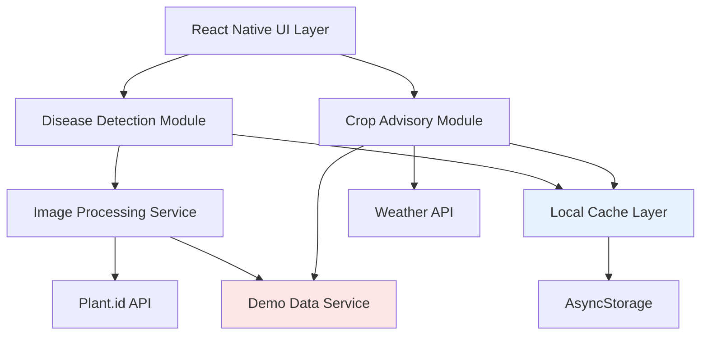

# Design Document: AI Farmer Assistance Features

## Overview

This design specifies the implementation of AI-powered features for the Farmer Assist mobile application, targeting the "AI for Bharat" hackathon with a 4-day implementation timeline. The system integrates crop disease detection, intelligent crop advisory, and weather-based recommendations into the existing React Native/Expo application.

The design prioritizes demo reliability through robust fallback mechanisms, offline capability through aggressive caching, and accessibility through multilingual support (English/Hindi). All AI features are designed to work with existing third-party APIs (Plant.id for disease detection, OpenWeatherMap for weather data) while maintaining graceful degradation when services are unavailable.

### Key Design Principles

1. **Demo-First Architecture**: Every AI feature includes a demo mode with pre-loaded sample data
2. **Offline-First**: Aggressive caching ensures core functionality works without connectivity
3. **Progressive Enhancement**: Features degrade gracefully from live API → cached data → demo mode
4. **Rapid Integration**: Leverage existing APIs and libraries rather than custom ML models
5. **Accessibility**: Simple UI with multilingual support for low-literacy users

## Architecture

### System Components



### Data Flow

**Disease Detection Flow:**
1. User captures/selects image → Image validation → Compression
2. Attempt API call to Plant.id with 10s timeout
3. On success: Display results + cache response
4. On failure: Check cache for similar images → Fall back to demo mode
5. Save scan to history (regardless of source)

**Crop Advisory Flow:**
1. Fetch weather data (with 6-hour cache validity)
2. Generate recommendations based on weather + season
3. On API failure: Use cached weather + display staleness indicator
4. On no cache: Use demo mode with generic seasonal advice

### Technology Stack

- **Frontend**: React Native 0.81.5, Expo SDK 54, TypeScript
- **Navigation**: Expo Router 6.0
- **Camera**: expo-camera (to be added)
- **Storage**: AsyncStorage via @react-native-async-storage/async-storage (to be added)
- **Image Processing**: expo-image-manipulator (to be added)
- **HTTP Client**: fetch API with timeout wrapper
- **Internationalization**: i18n-js (to be added)
- **AI Services**: Plant.id API, OpenWeatherMap API

## Components and Interfaces

### 1. Disease Detection Module

**Location**: `app/features/disease-detection/`

#### Core Components

**DiseaseDetectionScreen.tsx**
```typescript
interface DiseaseDetectionScreenProps {
  navigation: NavigationProp;
}

// Main screen with camera interface and scan history
```

**CameraInterface.tsx**
```typescript
interface CameraInterfaceProps {
  onCapture: (imageUri: string) => Promise<void>;
  onGallerySelect: () => Promise<void>;
}

// Handles camera capture with visual guidelines
// Shows framing overlay for proper image composition
```

**ScanResultsView.tsx**
```typescript
interface ScanResult {
  diseaseId: string;
  diseaseName: {
    en: string;
    hi: string;
  };
  confidence: number; // 0-100
  imageUri: string;
  treatments: Treatment[];
  timestamp: number;
  source: 'api' | 'cache' | 'demo';
}

interface Treatment {
  id: string;
  name: { en: string; hi: string };
  type: 'organic' | 'chemical';
  instructions: { en: string; hi: string };
  safetyNotes: { en: string; hi: string };
  estimatedCost?: number; // in INR
}

// Displays disease identification results with treatments
```

**ScanHistoryView.tsx**
```typescript
interface ScanHistoryItem {
  id: string;
  imageUri: string;
  diseaseName: { en: string; hi: string };
  confidence: number;
  timestamp: number;
  location?: string;
}

// Lists previous scans in reverse chronological order
// Supports grouping by field/location
```

#### Services

**ImageAnalysisService.ts**
```typescript
interface ImageAnalysisService {
  analyzeImage(imageUri: string): Promise<ScanResult>;
  validateImageQuality(imageUri: string): Promise<ValidationResult>;
  compressImage(imageUri: string): Promise<string>;
}

interface ValidationResult {
  isValid: boolean;
  issues: Array<'too_dark' | 'too_bright' | 'blurry' | 'no_plant'>;
  suggestions: { en: string; hi: string }[];
}

// Validates, compresses, and analyzes crop images
// Implements retry logic and fallback to demo mode
```

**PlantIdApiClient.ts**
```typescript
interface PlantIdApiClient {
  identifyDisease(imageBase64: string): Promise<ApiResponse>;
  checkHealth(): Promise<boolean>;
}

interface ApiResponse {
  suggestions: Array<{
    id: string;
    name: string;
    probability: number;
    similar_images: string[];
  }>;
  is_healthy: boolean;
}

// Wrapper for Plant.id API with timeout and error handling
// API Key stored in environment variables
```

**DiseaseCache.ts**
```typescript
interface DiseaseCache {
  saveScan(scan: ScanResult): Promise<void>;
  getScanHistory(limit?: number): Promise<ScanResult[]>;
  findSimilarScans(imageUri: string): Promise<ScanResult[]>;
  clearOldScans(keepRecent: number): Promise<void>;
}

// Manages local storage of scan results
// Implements LRU eviction when storage is limited
```

**TreatmentDatabase.ts**
```typescript
interface TreatmentDatabase {
  getTreatments(diseaseId: string): Promise<Treatment[]>;
  searchTreatments(query: string): Promise<Treatment[]>;
}

// Static database of treatments bundled with app
// Supports offline access to treatment recommendations
```

### 2. Crop Advisory Module

**Location**: `app/features/crop-advisory/`

#### Core Components

**CropAdvisoryScreen.tsx**
```typescript
interface CropAdvisoryScreenProps {
  navigation: NavigationProp;
}

// Main screen showing weather-based recommendations
```

**WeatherCard.tsx**
```typescript
interface WeatherData {
  temperature: number;
  humidity: number;
  rainfall: number;
  forecast: Array<{
    date: string;
    temp: number;
    condition: string;
  }>;
  lastUpdated: number;
  isStale: boolean;
}

// Displays current weather with visual indicators
// Shows staleness indicator when using cached data
```

**CropRecommendationsList.tsx**
```typescript
interface CropRecommendation {
  cropId: string;
  cropName: { en: string; hi: string };
  suitabilityScore: number; // 0-100
  reasoning: { en: string; hi: string };
  plantingGuidelines: {
    bestTime: string;
    soilPrep: { en: string; hi: string };
    wateringSchedule: { en: string; hi: string };
    expectedHarvest: string; // e.g., "90-120 days"
  };
  icon: string; // emoji
}

// Lists recommended crops with reasoning
// Expandable cards showing detailed guidelines
```

**FarmingAlertsView.tsx**
```typescript
interface FarmingAlert {
  id: string;
  type: 'rain' | 'heat' | 'frost' | 'wind';
  severity: 'info' | 'warning' | 'critical';
  message: { en: string; hi: string };
  actionable: { en: string; hi: string };
  icon: string;
  validUntil: number;
}

// Displays weather-based farming alerts
// Uses color coding and icons for quick recognition
```

#### Services

**WeatherService.ts**
```typescript
interface WeatherService {
  getCurrentWeather(location: Coordinates): Promise<WeatherData>;
  getForecast(location: Coordinates, days: number): Promise<WeatherData>;
  getCachedWeather(): Promise<WeatherData | null>;
}

interface Coordinates {
  latitude: number;
  longitude: number;
}

// Fetches weather data from OpenWeatherMap API
// Implements 6-hour cache validity
// Falls back to demo mode on failure
```

**CropAdvisoryEngine.ts**
```typescript
interface CropAdvisoryEngine {
  generateRecommendations(
    weather: WeatherData,
    season: Season,
    location: string
  ): Promise<CropRecommendation[]>;
  
  generateAlerts(weather: WeatherData): FarmingAlert[];
}

type Season = 'kharif' | 'rabi' | 'zaid'; // Indian agricultural seasons

// Rule-based engine for crop recommendations
// Considers temperature, rainfall, season, and region
```

**CropDatabase.ts**
```typescript
interface CropDatabase {
  getCropInfo(cropId: string): Promise<CropInfo>;
  searchCrops(filters: CropFilters): Promise<CropInfo[]>;
}

interface CropInfo {
  id: string;
  name: { en: string; hi: string };
  optimalTemp: { min: number; max: number };
  waterRequirement: 'low' | 'medium' | 'high';
  soilType: string[];
  growthDuration: number; // days
  season: Season[];
}

interface CropFilters {
  temperature?: number;
  rainfall?: number;
  season?: Season;
  region?: string;
}

// Static database of crop information
// Bundled with app for offline access
```

### 3. Shared Services

**Location**: `app/services/`

**CacheManager.ts**
```typescript
interface CacheManager {
  set<T>(key: string, value: T, ttl?: number): Promise<void>;
  get<T>(key: string): Promise<T | null>;
  isStale(key: string): Promise<boolean>;
  clear(pattern?: string): Promise<void>;
}

// Generic cache manager using AsyncStorage
// Supports TTL and staleness checking
```

**DemoDataService.ts**
```typescript
interface DemoDataService {
  getDemoScanResult(imageUri: string): Promise<ScanResult>;
  getDemoWeather(): Promise<WeatherData>;
  getDemoCropRecommendations(): Promise<CropRecommendation[]>;
  isDemoMode(): boolean;
  setDemoMode(enabled: boolean): void;
}

// Provides realistic sample data for demo mode
// Includes 10-15 pre-loaded disease samples
// Automatically activates when APIs are unavailable
```

**LocalizationService.ts**
```typescript
interface LocalizationService {
  setLanguage(lang: 'en' | 'hi'): void;
  getLanguage(): 'en' | 'hi';
  translate(key: string): string;
  translateObject<T extends Record<string, any>>(obj: T): string;
}

// Manages app language and translations
// Auto-detects device language on first launch
// Supports English and Hindi
```

**NetworkService.ts**
```typescript
interface NetworkService {
  fetchWithTimeout<T>(
    url: string,
    options: RequestInit,
    timeout: number
  ): Promise<T>;
  
  isOnline(): Promise<boolean>;
  
  retryWithBackoff<T>(
    fn: () => Promise<T>,
    maxRetries: number
  ): Promise<T>;
}

// Wrapper for fetch with timeout and retry logic
// Detects network connectivity
```

### 4. UI Components

**Location**: `components/features/`

**LanguageToggle.tsx**
```typescript
interface LanguageToggleProps {
  currentLanguage: 'en' | 'hi';
  onLanguageChange: (lang: 'en' | 'hi') => void;
}

// Toggle button for switching between English and Hindi
```

**DemoModeIndicator.tsx**
```typescript
interface DemoModeIndicatorProps {
  visible: boolean;
}

// Subtle banner indicating demo mode is active
// Positioned at top of screen with low opacity
```

**OfflineIndicator.tsx**
```typescript
interface OfflineIndicatorProps {
  isOffline: boolean;
}

// Small indicator showing offline status
```

**LoadingOverlay.tsx**
```typescript
interface LoadingOverlayProps {
  visible: boolean;
  message?: { en: string; hi: string };
  progress?: number; // 0-100
}

// Full-screen loading overlay with progress indicator
```

## Data Models

### Storage Schema

**AsyncStorage Keys:**
```typescript
const STORAGE_KEYS = {
  SCAN_HISTORY: 'farmer_assist:scan_history',
  WEATHER_CACHE: 'farmer_assist:weather_cache',
  CROP_RECOMMENDATIONS: 'farmer_assist:crop_recommendations',
  USER_LANGUAGE: 'farmer_assist:user_language',
  DEMO_MODE: 'farmer_assist:demo_mode',
  API_KEYS: 'farmer_assist:api_keys',
} as const;
```

**Scan History Storage:**
```typescript
interface StoredScanHistory {
  scans: ScanResult[];
  lastUpdated: number;
  version: number; // for migration support
}

// Maximum 50 scans stored
// Oldest scans evicted when limit reached
// Images stored as file URIs in app's document directory
```

**Weather Cache Storage:**
```typescript
interface StoredWeatherCache {
  data: WeatherData;
  cachedAt: number;
  location: Coordinates;
  ttl: number; // 6 hours = 21600000ms
}

// Single weather cache entry
// Invalidated after 6 hours
```

**Treatment Database Schema:**
```typescript
interface TreatmentRecord {
  diseaseId: string;
  diseaseName: { en: string; hi: string };
  treatments: Treatment[];
  symptoms: { en: string[]; hi: string[] };
  prevention: { en: string[]; hi: string[] };
}

// Static JSON file bundled with app
// Located at: assets/data/treatments.json
```

**Crop Database Schema:**
```typescript
interface CropRecord {
  id: string;
  name: { en: string; hi: string };
  scientificName: string;
  optimalConditions: {
    temperature: { min: number; max: number };
    rainfall: { min: number; max: number };
    soilPh: { min: number; max: number };
  };
  seasons: Season[];
  regions: string[];
  growthDuration: number;
  wateringSchedule: { en: string; hi: string };
  commonPests: string[];
  icon: string;
}

// Static JSON file bundled with app
// Located at: assets/data/crops.json
```

### Demo Data

**Pre-loaded Disease Samples:**
```typescript
interface DemoDiseaseSample {
  id: string;
  imagePath: string; // assets/demo/diseases/
  disease: {
    id: string;
    name: { en: string; hi: string };
    confidence: number;
  };
  treatments: Treatment[];
}

// 10-15 samples covering common diseases:
// - Leaf blight
// - Powdery mildew
// - Rust
// - Bacterial spot
// - Mosaic virus
// - Healthy plant (control)
```

**Demo Weather Data:**
```typescript
const DEMO_WEATHER: WeatherData = {
  temperature: 28,
  humidity: 65,
  rainfall: 0,
  forecast: [
    { date: '2025-03-01', temp: 29, condition: 'partly_cloudy' },
    { date: '2025-03-02', temp: 27, condition: 'rain' },
    { date: '2025-03-03', temp: 26, condition: 'rain' },
  ],
  lastUpdated: Date.now(),
  isStale: false,
};

// Realistic data for Central Valley region
// Updated to match current season
```

## Correctness Properties


*A property is a characteristic or behavior that should hold true across all valid executions of a system—essentially, a formal statement about what the system should do. Properties serve as the bridge between human-readable specifications and machine-verifiable correctness guarantees.*

### Property Reflection

After analyzing all acceptance criteria, several properties can be consolidated:

- Properties 1.3 and 1.4 (confidence threshold handling) can be combined into a single property about confidence-based filtering
- Properties 1.5, 3.3, 4.7, and 7.3 (multilingual display) are redundant and can be combined into one comprehensive property
- Properties 1.6, 3.1, 3.2, and 3.4 (treatment requirements) can be consolidated into a single property about treatment completeness
- Properties 4.5, 6.2, 6.3, and 8.1 (offline/fallback behavior) overlap and can be combined
- Properties 9.2 and 9.3 (UI feedback during loading) can be merged into one property about optimistic UI

### Core Properties

**Property 1: Image Processing Performance**
*For any* crop image captured or selected by a farmer, the Image_Analyzer should complete processing within 5 seconds and return either a valid result or an error.
**Validates: Requirements 1.2**

**Property 2: Confidence-Based Result Filtering**
*For any* disease identification result, if the confidence score is >= 60%, the result should be displayed to the user; if the confidence score is < 60%, a message requesting a clearer image should be displayed instead.
**Validates: Requirements 1.3, 1.4**

**Property 3: Multilingual Content Completeness**
*For any* displayed content (disease names, treatments, recommendations, alerts), both English and Hindi translations should be present and non-empty, with technical terms showing English + Hindi explanation when direct translation is unavailable.
**Validates: Requirements 1.5, 3.3, 4.7, 7.3, 7.4**

**Property 4: Treatment Database Completeness**
*For any* identified disease, the Treatment_Database should provide at least 3 treatment options, including both organic and chemical methods, with each treatment containing application instructions and safety precautions.
**Validates: Requirements 1.6, 3.1, 3.2, 3.4**

**Property 5: Scan Persistence with Metadata**
*For any* completed disease scan, the scan should be saved to Local_Cache with all required fields (image URI, disease name, confidence score, timestamp, location, treatments) and should be retrievable from scan history.
**Validates: Requirements 1.7, 1.10**

**Property 6: Graceful API Failure Handling**
*For any* API request failure (Plant.id, Weather API), the system should fall back to cached data if available, or demo mode if no cache exists, and display an appropriate indicator (staleness indicator for cache, demo mode indicator for demo data).
**Validates: Requirements 1.8, 4.5, 8.1, 8.2**

**Property 7: Offline Functionality Preservation**
*For any* offline state, the app should allow access to scan history, cached recommendations, and the treatment database without requiring network connectivity.
**Validates: Requirements 1.9, 6.3**

**Property 8: Image Quality Validation**
*For any* captured or selected image, the Image_Analyzer should validate quality (brightness, focus, plant visibility) and provide specific feedback when validation fails.
**Validates: Requirements 2.2, 2.3, 2.4**

**Property 9: Weather-Based Crop Recommendations**
*For any* weather data input, the Crop_Advisory_Module should generate at least 5 crop recommendations that are suitable for the current temperature, rainfall, and season, with each recommendation including reasoning and planting guidelines.
**Validates: Requirements 4.2, 4.3, 4.4, 4.6**

**Property 10: Weather-Based Alert Generation**
*For any* weather data indicating rainfall within 48 hours, temperature above 35°C, or frost risk, the Crop_Advisory_Module should generate appropriate farming alerts with actionable recommendations.
**Validates: Requirements 5.1, 5.2, 5.3**

**Property 11: Cache Storage Capacity and Eviction**
*For any* sequence of disease scans, the Local_Cache should store up to 50 scans, and when the limit is exceeded, should evict the oldest scans while preserving the 20 most recent scans.
**Validates: Requirements 6.5, 6.6**

**Property 12: Cache Synchronization on Reconnection**
*For any* network reconnection event, the Local_Cache should synchronize pending scans and fetch updated recommendations from the server.
**Validates: Requirements 6.4**

**Property 13: Language Switching Performance**
*For any* language change action, all UI text and content should update to the selected language within 1 second.
**Validates: Requirements 7.2**

**Property 14: Demo Mode Performance**
*For any* disease scan performed in demo mode, the Disease_Detection_Module should return realistic sample results within 2 seconds.
**Validates: Requirements 8.3**

**Property 15: Image Compression Before Upload**
*For any* image sent to the Plant_Disease_API, the image should be compressed to under 500KB before transmission.
**Validates: Requirements 9.4**

**Property 16: Network Request Timeout**
*For any* network request that exceeds 10 seconds, the system should timeout and fall back to cached data or demo mode.
**Validates: Requirements 9.5**

**Property 17: Optimistic UI Updates**
*For any* data loading operation (recommendations, weather), cached content should be displayed immediately while fresh data is being fetched in the background.
**Validates: Requirements 9.3**

**Property 18: Scan History Ordering**
*For any* scan history display, scans should be ordered in reverse chronological order (newest first).
**Validates: Requirements 10.1**

**Property 19: History Item Completeness**
*For any* scan displayed in history, the item should include thumbnail image, disease name, confidence score, and timestamp; when selected, full details including treatments should be displayed.
**Validates: Requirements 10.2, 10.3**

**Property 20: Scan Deletion Consistency**
*For any* scan deletion action, the scan should be removed from Local_Cache and the history view should update immediately to reflect the deletion.
**Validates: Requirements 10.5**

**Property 21: Camera Preview Performance**
*For any* camera open action, the camera preview should be displayed within 2 seconds.
**Validates: Requirements 9.1**

**Property 22: Weather Recommendation Refresh**
*For any* 6-hour period when the app is online, the Crop_Advisory_Module should refresh weather-based recommendations.
**Validates: Requirements 5.5**

## Error Handling

### Error Categories

**1. Network Errors**
- API timeout (>10s): Fall back to cached data → demo mode
- No connectivity: Use cached data, display offline indicator
- API rate limiting: Queue requests, use cached data temporarily
- Invalid API response: Log error, fall back to demo mode

**2. Image Processing Errors**
- Invalid image format: Display error message with supported formats
- Image too large (>10MB): Attempt compression, fail gracefully if compression fails
- No plant detected: Request user to capture image with visible plant material
- Camera permission denied: Display permission request dialog with explanation

**3. Storage Errors**
- Storage full: Trigger cache eviction, notify user if eviction fails
- Corrupted cache data: Clear corrupted entries, rebuild cache
- AsyncStorage quota exceeded: Implement aggressive eviction policy

**4. Data Validation Errors**
- Missing translations: Fall back to English with indicator
- Invalid disease ID: Log error, display generic error message
- Missing treatment data: Display partial data with warning

### Error Recovery Strategies

**Automatic Recovery:**
- Retry failed API calls with exponential backoff (3 attempts)
- Auto-switch to demo mode when APIs consistently fail
- Auto-clear corrupted cache entries
- Auto-compress oversized images

**User-Initiated Recovery:**
- Manual retry button for failed operations
- Clear cache option in settings
- Force refresh option for stale data
- Manual demo mode toggle for testing

### Error Logging

```typescript
interface ErrorLog {
  timestamp: number;
  category: 'network' | 'storage' | 'processing' | 'validation';
  severity: 'info' | 'warning' | 'error' | 'critical';
  message: string;
  context: Record<string, any>;
  stackTrace?: string;
}

// Errors logged to AsyncStorage for debugging
// Critical errors trigger user-visible notifications
// Logs capped at 100 entries (FIFO eviction)
```

## Testing Strategy

### Dual Testing Approach

The testing strategy employs both unit tests and property-based tests to ensure comprehensive coverage:

- **Unit tests**: Verify specific examples, edge cases, and error conditions
- **Property tests**: Verify universal properties across all inputs
- Both approaches are complementary and necessary for comprehensive validation

### Unit Testing

Unit tests focus on:
- Specific examples demonstrating correct behavior (e.g., processing a specific disease image)
- Integration points between components (e.g., CacheManager ↔ DiseaseCache)
- Edge cases (e.g., empty scan history, corrupted cache data)
- Error conditions (e.g., API timeout, invalid image format)

**Key Unit Test Suites:**

1. **ImageAnalysisService Tests**
   - Test specific disease images with known results
   - Test invalid image formats (PDF, video files)
   - Test oversized images (>10MB)
   - Test API timeout scenarios
   - Test demo mode fallback

2. **CacheManager Tests**
   - Test cache hit/miss scenarios
   - Test TTL expiration
   - Test storage quota handling
   - Test corrupted data recovery

3. **LocalizationService Tests**
   - Test language switching
   - Test missing translation fallback
   - Test device language detection

4. **CropAdvisoryEngine Tests**
   - Test specific weather conditions → expected recommendations
   - Test season-based filtering
   - Test alert generation for extreme weather

### Property-Based Testing

Property tests verify universal correctness properties across randomized inputs. We'll use **fast-check** (JavaScript property testing library) with minimum 100 iterations per test.

**Configuration:**
```typescript
import fc from 'fast-check';

// Minimum 100 iterations per property test
const TEST_CONFIG = { numRuns: 100 };
```

**Property Test Suites:**

1. **Image Processing Properties**
```typescript
// Feature: ai-farmer-features, Property 1: Image Processing Performance
fc.assert(
  fc.property(
    fc.imageUri(), // arbitrary image URI generator
    async (imageUri) => {
      const startTime = Date.now();
      const result = await imageAnalysisService.analyzeImage(imageUri);
      const duration = Date.now() - startTime;
      
      expect(duration).toBeLessThan(5000);
      expect(result).toBeDefined();
    }
  ),
  TEST_CONFIG
);

// Feature: ai-farmer-features, Property 2: Confidence-Based Result Filtering
fc.assert(
  fc.property(
    fc.scanResult(), // arbitrary scan result generator
    (scanResult) => {
      const shouldDisplay = scanResult.confidence >= 60;
      const displayResult = filterResultByConfidence(scanResult);
      
      if (shouldDisplay) {
        expect(displayResult.type).toBe('result');
        expect(displayResult.data).toEqual(scanResult);
      } else {
        expect(displayResult.type).toBe('retry_message');
      }
    }
  ),
  TEST_CONFIG
);

// Feature: ai-farmer-features, Property 15: Image Compression Before Upload
fc.assert(
  fc.property(
    fc.imageUri(),
    async (imageUri) => {
      const compressedUri = await imageService.compressImage(imageUri);
      const fileSize = await getFileSize(compressedUri);
      
      expect(fileSize).toBeLessThan(500 * 1024); // 500KB
    }
  ),
  TEST_CONFIG
);
```

2. **Multilingual Properties**
```typescript
// Feature: ai-farmer-features, Property 3: Multilingual Content Completeness
fc.assert(
  fc.property(
    fc.diseaseResult(), // arbitrary disease result generator
    (diseaseResult) => {
      expect(diseaseResult.diseaseName.en).toBeTruthy();
      expect(diseaseResult.diseaseName.hi).toBeTruthy();
      
      diseaseResult.treatments.forEach(treatment => {
        expect(treatment.name.en).toBeTruthy();
        expect(treatment.name.hi).toBeTruthy();
        expect(treatment.instructions.en).toBeTruthy();
        expect(treatment.instructions.hi).toBeTruthy();
      });
    }
  ),
  TEST_CONFIG
);

// Feature: ai-farmer-features, Property 13: Language Switching Performance
fc.assert(
  fc.property(
    fc.constantFrom('en', 'hi'),
    async (targetLanguage) => {
      const startTime = Date.now();
      await localizationService.setLanguage(targetLanguage);
      const duration = Date.now() - startTime;
      
      expect(duration).toBeLessThan(1000);
      expect(localizationService.getLanguage()).toBe(targetLanguage);
    }
  ),
  TEST_CONFIG
);
```

3. **Cache Properties**
```typescript
// Feature: ai-farmer-features, Property 5: Scan Persistence with Metadata
fc.assert(
  fc.property(
    fc.scanResult(),
    async (scan) => {
      await diseaseCache.saveScan(scan);
      const history = await diseaseCache.getScanHistory();
      
      const savedScan = history.find(s => s.id === scan.id);
      expect(savedScan).toBeDefined();
      expect(savedScan.imageUri).toBeTruthy();
      expect(savedScan.diseaseName).toBeTruthy();
      expect(savedScan.confidence).toBeGreaterThanOrEqual(0);
      expect(savedScan.timestamp).toBeTruthy();
      expect(savedScan.treatments).toBeTruthy();
    }
  ),
  TEST_CONFIG
);

// Feature: ai-farmer-features, Property 11: Cache Storage Capacity and Eviction
fc.assert(
  fc.property(
    fc.array(fc.scanResult(), { minLength: 60, maxLength: 100 }),
    async (scans) => {
      // Clear cache first
      await diseaseCache.clearOldScans(0);
      
      // Add all scans
      for (const scan of scans) {
        await diseaseCache.saveScan(scan);
      }
      
      const history = await diseaseCache.getScanHistory();
      
      // Should store max 50 scans
      expect(history.length).toBeLessThanOrEqual(50);
      
      // Should preserve most recent 20 at minimum
      const recentScans = scans.slice(-20);
      recentScans.forEach(recentScan => {
        expect(history.some(h => h.id === recentScan.id)).toBe(true);
      });
    }
  ),
  TEST_CONFIG
);

// Feature: ai-farmer-features, Property 20: Scan Deletion Consistency
fc.assert(
  fc.property(
    fc.array(fc.scanResult(), { minLength: 5, maxLength: 20 }),
    fc.integer({ min: 0, max: 19 }),
    async (scans, deleteIndex) => {
      // Setup: save all scans
      for (const scan of scans) {
        await diseaseCache.saveScan(scan);
      }
      
      const scanToDelete = scans[deleteIndex % scans.length];
      
      // Delete scan
      await diseaseCache.deleteScan(scanToDelete.id);
      
      // Verify deletion
      const history = await diseaseCache.getScanHistory();
      expect(history.some(s => s.id === scanToDelete.id)).toBe(false);
    }
  ),
  TEST_CONFIG
);
```

4. **Fallback and Offline Properties**
```typescript
// Feature: ai-farmer-features, Property 6: Graceful API Failure Handling
fc.assert(
  fc.property(
    fc.imageUri(),
    fc.boolean(), // has cache
    async (imageUri, hasCache) => {
      // Mock API failure
      mockApiFailure();
      
      if (hasCache) {
        await cacheManager.set('last_scan', mockScanResult);
      }
      
      const result = await imageAnalysisService.analyzeImage(imageUri);
      
      if (hasCache) {
        expect(result.source).toBe('cache');
      } else {
        expect(result.source).toBe('demo');
      }
      
      // Should have appropriate indicator
      expect(result.indicator).toBeTruthy();
    }
  ),
  TEST_CONFIG
);

// Feature: ai-farmer-features, Property 7: Offline Functionality Preservation
fc.assert(
  fc.property(
    fc.array(fc.scanResult(), { minLength: 1, maxLength: 10 }),
    async (cachedScans) => {
      // Setup cache
      for (const scan of cachedScans) {
        await diseaseCache.saveScan(scan);
      }
      
      // Simulate offline
      mockOfflineState();
      
      // Should still access history
      const history = await diseaseCache.getScanHistory();
      expect(history.length).toBe(cachedScans.length);
      
      // Should still access treatments
      const treatments = await treatmentDatabase.getTreatments('disease_1');
      expect(treatments).toBeTruthy();
    }
  ),
  TEST_CONFIG
);

// Feature: ai-farmer-features, Property 16: Network Request Timeout
fc.assert(
  fc.property(
    fc.imageUri(),
    async (imageUri) => {
      // Mock slow API (>10s)
      mockSlowApi(15000);
      
      const startTime = Date.now();
      const result = await imageAnalysisService.analyzeImage(imageUri);
      const duration = Date.now() - startTime;
      
      // Should timeout and fallback
      expect(duration).toBeLessThan(11000);
      expect(result.source).toMatch(/cache|demo/);
    }
  ),
  TEST_CONFIG
);
```

5. **Crop Advisory Properties**
```typescript
// Feature: ai-farmer-features, Property 9: Weather-Based Crop Recommendations
fc.assert(
  fc.property(
    fc.weatherData(), // arbitrary weather generator
    fc.season(),
    async (weather, season) => {
      const recommendations = await cropAdvisoryEngine.generateRecommendations(
        weather,
        season,
        'Central Valley'
      );
      
      // Should have at least 5 recommendations
      expect(recommendations.length).toBeGreaterThanOrEqual(5);
      
      // Each should have required fields
      recommendations.forEach(rec => {
        expect(rec.cropName.en).toBeTruthy();
        expect(rec.cropName.hi).toBeTruthy();
        expect(rec.reasoning.en).toBeTruthy();
        expect(rec.reasoning.hi).toBeTruthy();
        expect(rec.plantingGuidelines).toBeTruthy();
        expect(rec.suitabilityScore).toBeGreaterThanOrEqual(0);
        expect(rec.suitabilityScore).toBeLessThanOrEqual(100);
      });
      
      // Recommendations should be suitable for weather
      recommendations.forEach(rec => {
        const cropInfo = await cropDatabase.getCropInfo(rec.cropId);
        expect(weather.temperature).toBeGreaterThanOrEqual(cropInfo.optimalTemp.min);
        expect(weather.temperature).toBeLessThanOrEqual(cropInfo.optimalTemp.max);
      });
    }
  ),
  TEST_CONFIG
);

// Feature: ai-farmer-features, Property 10: Weather-Based Alert Generation
fc.assert(
  fc.property(
    fc.weatherData(),
    (weather) => {
      const alerts = cropAdvisoryEngine.generateAlerts(weather);
      
      // Check rainfall alert
      if (weather.forecast.some(f => f.rainfall > 0 && f.hoursAway <= 48)) {
        expect(alerts.some(a => a.type === 'rain')).toBe(true);
      }
      
      // Check heat alert
      if (weather.temperature > 35) {
        expect(alerts.some(a => a.type === 'heat')).toBe(true);
      }
      
      // Check frost alert
      if (weather.temperature < 5) {
        expect(alerts.some(a => a.type === 'frost')).toBe(true);
      }
      
      // All alerts should have required fields
      alerts.forEach(alert => {
        expect(alert.message.en).toBeTruthy();
        expect(alert.message.hi).toBeTruthy();
        expect(alert.actionable.en).toBeTruthy();
        expect(alert.actionable.hi).toBeTruthy();
      });
    }
  ),
  TEST_CONFIG
);
```

6. **Ordering and Display Properties**
```typescript
// Feature: ai-farmer-features, Property 18: Scan History Ordering
fc.assert(
  fc.property(
    fc.array(fc.scanResult(), { minLength: 2, maxLength: 20 }),
    async (scans) => {
      // Save scans with different timestamps
      for (let i = 0; i < scans.length; i++) {
        scans[i].timestamp = Date.now() + i * 1000;
        await diseaseCache.saveScan(scans[i]);
      }
      
      const history = await diseaseCache.getScanHistory();
      
      // Should be in reverse chronological order
      for (let i = 0; i < history.length - 1; i++) {
        expect(history[i].timestamp).toBeGreaterThanOrEqual(history[i + 1].timestamp);
      }
    }
  ),
  TEST_CONFIG
);

// Feature: ai-farmer-features, Property 19: History Item Completeness
fc.assert(
  fc.property(
    fc.scanResult(),
    async (scan) => {
      await diseaseCache.saveScan(scan);
      const history = await diseaseCache.getScanHistory();
      
      const historyItem = history.find(h => h.id === scan.id);
      
      // List view should have summary fields
      expect(historyItem.imageUri).toBeTruthy();
      expect(historyItem.diseaseName).toBeTruthy();
      expect(historyItem.confidence).toBeDefined();
      expect(historyItem.timestamp).toBeTruthy();
      
      // Detail view should have full fields
      const details = await diseaseCache.getScanDetails(scan.id);
      expect(details.treatments).toBeTruthy();
      expect(details.treatments.length).toBeGreaterThan(0);
    }
  ),
  TEST_CONFIG
);
```

### Custom Generators for Property Tests

```typescript
// Custom arbitraries for domain-specific data
const arbitraries = {
  imageUri: () => fc.string().map(s => `file://images/${s}.jpg`),
  
  confidence: () => fc.integer({ min: 0, max: 100 }),
  
  scanResult: () => fc.record({
    id: fc.uuid(),
    diseaseId: fc.string(),
    diseaseName: fc.record({
      en: fc.string(),
      hi: fc.string(),
    }),
    confidence: arbitraries.confidence(),
    imageUri: arbitraries.imageUri(),
    treatments: fc.array(arbitraries.treatment(), { minLength: 3, maxLength: 5 }),
    timestamp: fc.integer({ min: Date.now() - 86400000, max: Date.now() }),
    source: fc.constantFrom('api', 'cache', 'demo'),
  }),
  
  treatment: () => fc.record({
    id: fc.uuid(),
    name: fc.record({ en: fc.string(), hi: fc.string() }),
    type: fc.constantFrom('organic', 'chemical'),
    instructions: fc.record({ en: fc.string(), hi: fc.string() }),
    safetyNotes: fc.record({ en: fc.string(), hi: fc.string() }),
    estimatedCost: fc.option(fc.integer({ min: 100, max: 5000 })),
  }),
  
  weatherData: () => fc.record({
    temperature: fc.integer({ min: -5, max: 45 }),
    humidity: fc.integer({ min: 0, max: 100 }),
    rainfall: fc.integer({ min: 0, max: 200 }),
    forecast: fc.array(fc.record({
      date: fc.date(),
      temp: fc.integer({ min: -5, max: 45 }),
      condition: fc.constantFrom('sunny', 'cloudy', 'rain', 'storm'),
      rainfall: fc.integer({ min: 0, max: 100 }),
      hoursAway: fc.integer({ min: 0, max: 168 }),
    }), { minLength: 3, maxLength: 7 }),
    lastUpdated: fc.integer({ min: Date.now() - 86400000, max: Date.now() }),
    isStale: fc.boolean(),
  }),
  
  season: () => fc.constantFrom('kharif', 'rabi', 'zaid'),
  
  diseaseResult: () => arbitraries.scanResult(),
};
```

### Integration Testing

Integration tests verify end-to-end flows:
- Camera capture → image processing → result display → cache storage
- Weather fetch → recommendation generation → alert creation → UI display
- Offline mode → cache access → online mode → sync

### Testing Timeline (4 days)

**Day 1-2**: Write unit tests alongside implementation
**Day 3**: Implement property-based tests for core properties
**Day 4**: Integration tests and demo mode validation

### Test Coverage Goals

- Unit test coverage: >80% for services and utilities
- Property test coverage: All 22 correctness properties implemented
- Integration test coverage: All critical user flows (disease detection, crop advisory)
- Demo mode: 100% coverage (essential for hackathon presentation)

## Implementation Notes

### Dependencies to Add

```json
{
  "dependencies": {
    "expo-camera": "~16.0.0",
    "expo-image-manipulator": "~14.0.0",
    "@react-native-async-storage/async-storage": "~2.1.0",
    "i18n-js": "^4.4.3",
    "expo-location": "~18.0.0"
  },
  "devDependencies": {
    "fast-check": "^3.15.0",
    "@types/jest": "^29.5.0"
  }
}
```

### API Keys Required

- Plant.id API key (free tier: 100 requests/day)
- OpenWeatherMap API key (free tier: 1000 requests/day)

Store in `.env`:
```
PLANT_ID_API_KEY=your_key_here
OPENWEATHER_API_KEY=your_key_here
```

### File Structure

```
app/
├── features/
│   ├── disease-detection/
│   │   ├── screens/
│   │   │   ├── DiseaseDetectionScreen.tsx
│   │   │   └── ScanHistoryScreen.tsx
│   │   ├── components/
│   │   │   ├── CameraInterface.tsx
│   │   │   ├── ScanResultsView.tsx
│   │   │   └── ScanHistoryView.tsx
│   │   └── services/
│   │       ├── ImageAnalysisService.ts
│   │       ├── PlantIdApiClient.ts
│   │       ├── DiseaseCache.ts
│   │       └── TreatmentDatabase.ts
│   └── crop-advisory/
│       ├── screens/
│       │   └── CropAdvisoryScreen.tsx
│       ├── components/
│       │   ├── WeatherCard.tsx
│       │   ├── CropRecommendationsList.tsx
│       │   └── FarmingAlertsView.tsx
│       └── services/
│           ├── WeatherService.ts
│           ├── CropAdvisoryEngine.ts
│           └── CropDatabase.ts
├── services/
│   ├── CacheManager.ts
│   ├── DemoDataService.ts
│   ├── LocalizationService.ts
│   └── NetworkService.ts
├── components/
│   └── features/
│       ├── LanguageToggle.tsx
│       ├── DemoModeIndicator.tsx
│       ├── OfflineIndicator.tsx
│       └── LoadingOverlay.tsx
└── assets/
    ├── data/
    │   ├── treatments.json
    │   ├── crops.json
    │   └── translations.json
    └── demo/
        └── diseases/
            ├── leaf_blight.jpg
            ├── powdery_mildew.jpg
            └── ... (10-15 samples)
```

### Performance Optimizations

1. **Image Compression**: Use expo-image-manipulator to compress images before upload
2. **Lazy Loading**: Load treatment database and crop database on demand
3. **Memoization**: Cache expensive computations (crop recommendations, alert generation)
4. **Optimistic UI**: Show cached data immediately, update when fresh data arrives
5. **Background Sync**: Sync pending scans in background when connectivity restored

### Accessibility Considerations

1. **Large Touch Targets**: Minimum 44x44pt for all interactive elements
2. **High Contrast**: Ensure text is readable in bright sunlight
3. **Icon + Text**: Always pair icons with text labels
4. **Simple Language**: Use simple Hindi and English for low-literacy users
5. **Voice Feedback**: Consider adding voice output for treatment instructions (future enhancement)

### Demo Mode Strategy

Demo mode is critical for hackathon success:

1. **Auto-Activation**: Automatically enable when APIs fail
2. **Realistic Data**: Use actual crop disease images and realistic recommendations
3. **Fast Response**: Return results within 2 seconds
4. **Subtle Indicator**: Show "Demo Mode" badge without being intrusive
5. **Manual Toggle**: Allow manual activation for testing and presentation

### Hackathon Presentation Tips

1. **Prepare Demo Script**: Have a rehearsed flow through all features
2. **Offline Demo**: Demonstrate offline functionality
3. **Multilingual Demo**: Show language switching
4. **Before/After**: Show scan history with multiple disease identifications
5. **Weather Alerts**: Demonstrate alert generation with different weather conditions
6. **Fallback Demo**: Show graceful degradation when APIs fail
